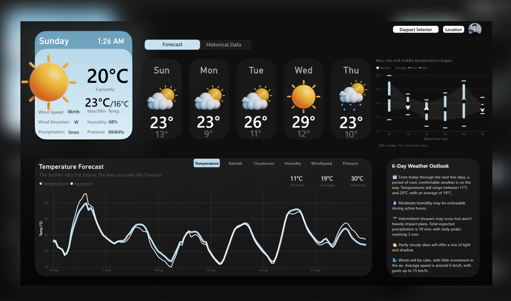

## Weather App – Power BI

A Power BI application created as part of a portfolio project.
It includes two main modules:
- 6-Day Weather Forecast – powered by Open-Meteo API, allowing real-time tracking of short-term weather forecasts.
- Historical Analysis – visualization and analysis of nearly 60 years of temperature data, enabling insights into long-term climate trends.

**Note: The dataset files (both .abf and .csv) are not included in this repository.**

